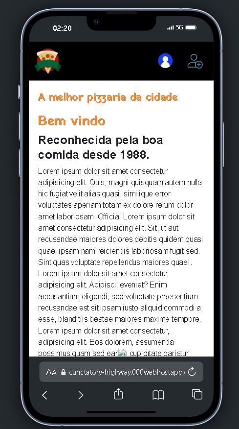
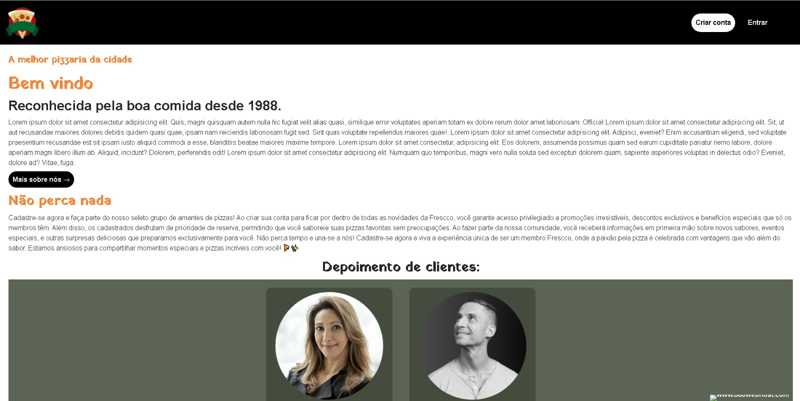

<h1 align="center">Frescco pizzeria🍕
</h1>

Web application made with the purpose of presenting a pizzeria and customer reviews, with a login and customer registration system, using PHP sessions, where the idea is that customers who have a registration receive benefits..

<h2>Check out the hosted project📲 </h2>
<a href="https://cunctatory-highway.000webhostapp.com/" target="_blank">Access project here✅</a>

    
    

# Technologies

git clone https://github.com/arthurdavidonisrd/hamburgueria.git
 

<h2>Project Purpose</h2>

Practice and apply web development fundamentals. Create a web system applicable to the real world, 100% responsive and interactive with the user. A food enterprise web system, where you can see all the commnents about the service and the best qualitys they have to offer to the clients.

